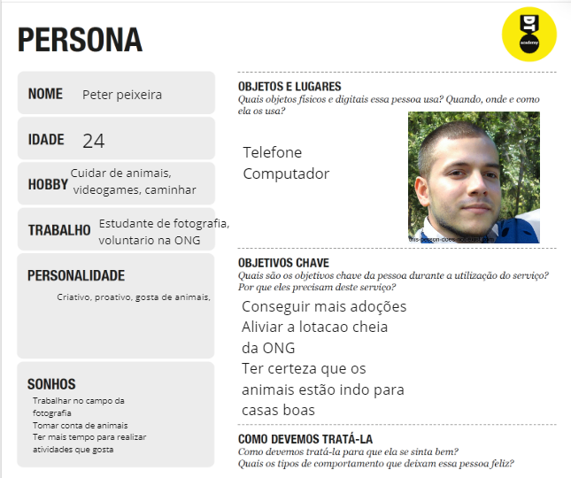
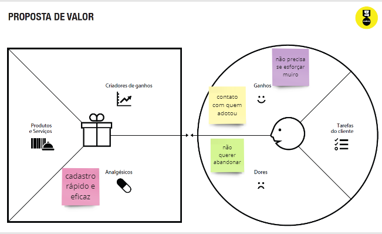
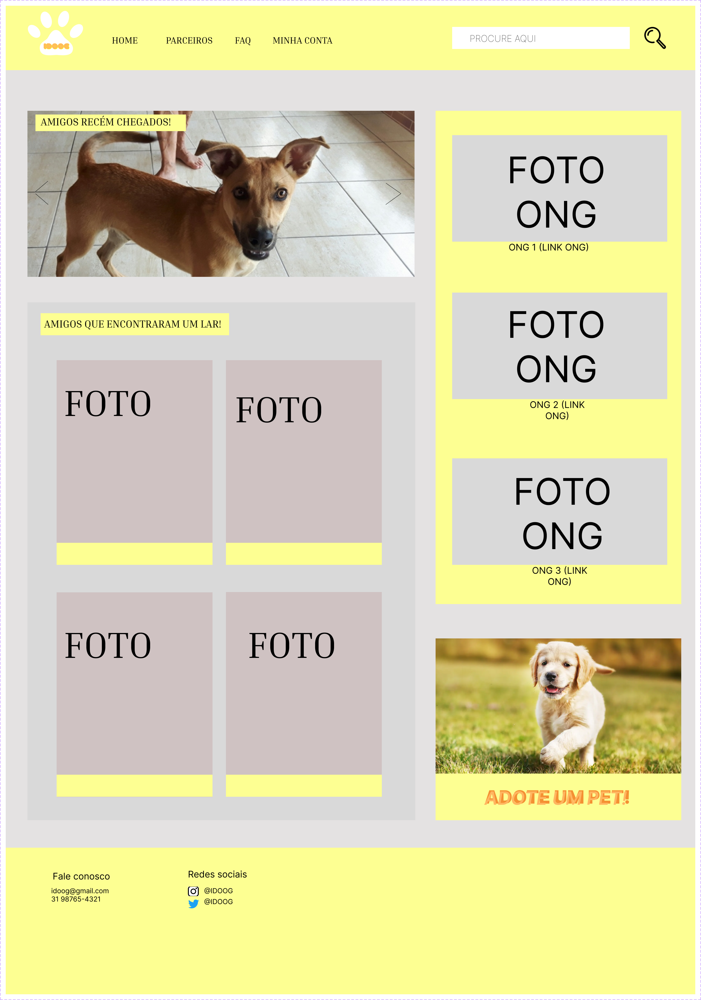
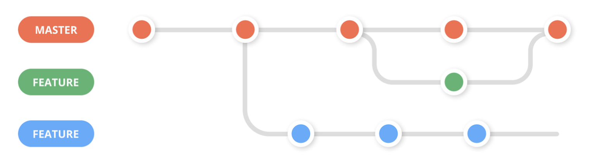

# Informações do Projeto
`TÍTULO DO PROJETO`  

IDOOG

`CURSO` 

Engenharia de Software

## Participantes
>
> Os membros do grupo são: 
> - Bruno Henrique Figuereido Guanabarino Penna Lopes
> - Lucas Ferreira Garcia
> - Maisa Pires de Andrade
> - Miguel Vieira de Souza
> - Pedro Henrique Dias Camara
> - Rafael Amaral Avelar

# Estrutura do Documento

- [Informações do Projeto](#informações-do-projeto)
  - [Participantes](#participantes)
- [Estrutura do Documento](#estrutura-do-documento)
- [Introdução](#introdução)
  - [Problema](#problema)
  - [Objetivos](#objetivos)
  - [Justificativa](#justificativa)
  - [Público-Alvo](#público-alvo)
- [Especificações do Projeto](#especificações-do-projeto)
  - [Personas, Empatia e Proposta de Valor](#personas-empatia-e-proposta-de-valor)
  - [Histórias de Usuários](#histórias-de-usuários)
  - [Requisitos](#requisitos)
    - [Requisitos Funcionais](#requisitos-funcionais)
    - [Requisitos não Funcionais](#requisitos-não-funcionais)
  - [Restrições](#restrições)
- [Projeto de Interface](#projeto-de-interface)
  - [User Flow](#user-flow)
  - [Wireframes](#wireframes)
- [Metodologia](#metodologia)
  - [Divisão de Papéis](#divisão-de-papéis)
  - [Ferramentas](#ferramentas)
  - [Controle de Versão](#controle-de-versão)
- [**############## SPRINT 1 ACABA AQUI #############**](#-sprint-1-acaba-aqui-)
- [Projeto da Solução](#projeto-da-solução)
  - [Tecnologias Utilizadas](#tecnologias-utilizadas)
  - [Arquitetura da solução](#arquitetura-da-solução)
- [Avaliação da Aplicação](#avaliação-da-aplicação)
  - [Plano de Testes](#plano-de-testes)
  - [Ferramentas de Testes (Opcional)](#ferramentas-de-testes-opcional)
  - [Registros de Testes](#registros-de-testes)
- [Referências](#referências)

# Introdução
No Brasil, temos aproximadamente 200 mil animais de rua que foram resgatados pelas organizações não governamentais (ONGs). Existem cerca de 370 ONGs que estão em atuação no Brasil.

Diante dessa informação, percebemos que as ONGs estão sofrendo por superlotação, pois quando ocorreu a pandemia devido ao vírus COVID-19 houve um crescimento no abandono de animais devido a problemas econômicos. Ademais, pelo número grande de animais resgatados os voluntários utilizam grande parte de seu tempo livre para manter os cuidados, sendo assim ficam sem tempo para realizar os processos de publicar o animal que está disponível para adoção e realização de entrevistas entre outros procedimentos, Os voluntários também possuem uma vida fora da ONG, já que não sobrevivem com dinheiro arrecadado. Com isso acaba que pessoas que querem adotar não tem conhecimento de quais animais estão disponíveis, e quando não há saída de animais desses locais acontece a superlotação.
## Problema

De acordo com as informações da introdução, o problema que se caracteriza é a dificuldade de realizar os procedimentos desde anunciar/cadastrar o animal para adoção até os processos para que o animal seja adotado, sejam eles entrevistas ou leitura de formulários

## Objetivos

O objetivo do projeto é criar um portal onde os voluntários cadastrem os animais de forma eficiente que apresente facilidade e simplicidade para otimizar o tempo do voluntário.

>Objetivos de destaque são:
> * Permitir a criação de um formulário de pré-requisito para validar ou invalidar a pessoa interessada em adotar, assim otimizando a leitura.
> * Fazer com que o interessado a adotar um animal realize um cadastro no site já contendo informações que ajudem os voluntários a entender qual tipo de pessoa estão lidando.
> * Colocar a possibilidade de adotar animais fora de sua região, facilitando o encontro das ONGS com pessoas interessadas em adotar.

## Justificativa

Após diversas conversas e convivência no dia a dia, percebemos que mesmo além de ajudar os animais precisamos ajudar quem ajuda os animais, ou seja os voluntários, criando algo que otimize o tempo deles estará sendo dado oportunidades para os animais encontrar um lar de maneira mais fácil e mais rápida.

## Público-Alvo

As pessoas mais afetadas são aquelas que são voluntárias de ONGs que estão com seu tempo curto para realizar o cadastro de animais para adoção e também todas aquelas pessoas que possuem interesse em adotar um animal.

Desta forma, definimos nosso público alvo homens e mulheres entre 18 a 45 anos que são voluntários de uma ONG e estão com um curto período de tempo por causa de suas outras atividades ou pessoas que tem intenção em adotar algum animal.

 
# Especificações do Projeto

A definição exata do problema e os pontos mais relevantes a serem tratados neste projeto foi consolidada com a participação dos usuários em um trabalho de imersão feito pelos membros da equipe a partir da observação dos usuários em seu local natural e por meio de entrevistas. Os detalhes levantados nesse processo foram consolidados na forma de personas e histórias de usuários.

## Personas, Empatia e Proposta de Valor

As personas levantadas durante o processo de entendimento do problema são apresentadas na Figuras que se seguem.

> **Personas**
> 
> 
>
> **Proposta de Valor Maria**
>
> 
> 
> 
>
> **Proposta de Valor Peter**
>
> 
> 
> 
>
> **Proposta de Valor Peter**
>
> 
> 

## Histórias de Usuários

> **Com base na análise das personas foram identificadas as seguintes histórias de usuários:**
>
> 
>

## Requisitos

As tabelas que se seguem apresentam os requisitos funcionais e não funcionais que detalham o escopo do projeto.

### Requisitos Funcionais

> 

### Requisitos não Funcionais

> 

## Restrições

>**O projeto está restrito pelos itens apresentados na tabela a seguir.**

> 

# Projeto de Interface

## User Flow

> 

## Wireframes

> 
A barra de navegação se manterá no layout de todas as páginas, apresentando botões para levar a outras áreas do site. O footer também se manterá no layout, e apresenta informações de contato e redes sociais da empresa.
Na página inicial é exposto um carrossel que será constantemente atualizado, apresentando os animais recém cadastrados para adoção, um aside com links para os sites oficiais de ONGs parceiras, cards com fotos dos animais adotados pelo site com seus donos e um botão no fim da página que leva para a parte do site onde os pets disponíveis são apresentados.
> 
Nessa página há painéis com fotos, informações básicas e links para os sites oficiais de ONGs, abrigos, petshops, entre outros parceiros; para que o usuário possa conhecer os colaboradores do projeto e saber mais do objetivo da Idoog.
> 
Essa é a página onde serão expostos os pets disponíveis para adoção, nela será possível filtrar a busca pelo animal ou idade, além de apresentar colunas de divisão entre aqueles que foram postos para adoção recentemente, filhotes e aqueles que já estão esperando por um lar há bastante tempo.
> 
Essa janela será um pop-up com informações gerais do pet e um botão que levará a um formulário caso exista interesse na adoção, uma janela como essa é criada para cada animal cadastrado.
> 
Nesta página, existe um painel  com perguntas frequentes para que o usuário possa encontrar  respostas para possíveis dúvidas com facilidade, também há um  outro painel com sobre a proposta de valor, missão, objetivos  e breve história da Idog.
> 
Essa é a página de perfil do usuário, onde é encontrado os dados usado pelo usuário no cadastro e um botão que leva a um formulário caso haja interesse do cliente em cadastrar seu pet, ou outro animal resgatado, para adoção.

# Metodologia

O grupo começou o trabalho criando uma matriz de alinhamento CSD e montando uma entrevista em conjunto, por meio da aula presencial disponível e por rápidas reuniões online. Com as perguntas prontas, o grupo entrou em comunicação com uma ONG e buscou depoimentos de outras. Com essas informações o grupo montou uma persona esperada para o projeto. Todas informações adquiridas até esse ponto foram documentadas no aplicativo Miro. Para a construção da documentação do Sprint 1 o grupo dividiu as tarefas entre si e, quando completas, revisaram o projeto antes da entrega.

## Divisão de Papéis

> **O grupo trabalhou em conjunto nos passos anteriores à construção do relatório técnico.**
> - Bruno Henrique Figueiredo Lopes: Contexto do projeto
> - Lucas Ferreira Garcia: Metodologia
> - Maisa Pires de Andrade: Wireframe
> - iguel Vieira de Souza: Wireframe
> - Pedro Henrique Dias: Metodologia
> - Rafael Amaral Avelar: Especificação do projeto

## Ferramentas

| Ambiente  | Plataforma              |Link de Acesso |
|-----------|-------------------------|---------------|
|Processo de Design Thinkgin  | Miro |  https://miro.com/app/board/uXjVMYDTGtk=/ | 
|Repositório de código | GitHub | https://github.com/ICEI-PUC-Minas-PPLES-TI/plf-es-2023-1-ti1-0385100-problemas-com-pets-2 | 
|Protótipo Interativo | Figma | https://www.figma.com/file/HToAHSg4kucnQSuJqYZHkv/Untitled?node-id=0-1&t=OmUrxSFuAVxTtBIu-0 | 
|Editor de código | Visual Studio Code | https://code.visualstudio.com | 

#> **Links Úteis - Hospedagem**:
#> - [Getting Started with Heroku](https://devcenter.heroku.com/start)
#> - [Crie seu Site com o HostGator](https://www.hostgator.com.br/como-publicar-seu-site)
#> - [GoDady](https://br.godaddy.com/how-to)
#> - [GitHub Pages](https://pages.github.com/)

## Controle de Versão

> Discuta como a configuração do projeto foi feita na ferramenta de
> versionamento escolhida. Exponha como a gerência de tags, merges,
> commits e branchs é realizada. Discuta como a gerência de issues foi
> realizada.
> A ferramenta de controle de versão adotada no projeto foi o
> [Git](https://git-scm.com/), sendo que o [Github](https://github.com)
> foi utilizado para hospedagem do repositório `upstream`.
> 
> O projeto segue a seguinte convenção para o nome de branchs:
> 
> - `master`: versão estável já testada do software
> - `unstable`: versão já testada do software, porém instável
> - `testing`: versão em testes do software
> - `dev`: versão de desenvolvimento do software
> 
> Quanto à gerência de issues, o projeto adota a seguinte convenção para
> etiquetas:
> 
> - `bugfix`: uma funcionalidade encontra-se com problemas
> - `enhancement`: uma funcionalidade precisa ser melhorada
> - `feature`: uma nova funcionalidade precisa ser introduzida
>
> **Links Úteis**:
> - [Tutorial GitHub](https://guides.github.com/activities/hello-world/)
> - [Git e Github](https://www.youtube.com/playlist?list=PLHz_AreHm4dm7ZULPAmadvNhH6vk9oNZA)
> - [5 Git Workflows & Branching Strategy to deliver better code](https://zepel.io/blog/5-git-workflows-to-improve-development/)
>
> **Exemplo - GitHub Feature Branch Workflow**:
>
> 

# **############## SPRINT 1 ACABA AQUI #############**

# Projeto da Solução

......  COLOQUE AQUI O SEU TEXTO ......

## Tecnologias Utilizadas

......  COLOQUE AQUI O SEU TEXTO ......

> Descreva aqui qual(is) tecnologias você vai usar para resolver o seu
> problema, ou seja, implementar a sua solução. Liste todas as
> tecnologias envolvidas, linguagens a serem utilizadas, serviços web,
> frameworks, bibliotecas, IDEs de desenvolvimento, e ferramentas.
> Apresente também uma figura explicando como as tecnologias estão
> relacionadas ou como uma interação do usuário com o sistema vai ser
> conduzida, por onde ela passa até retornar uma resposta ao usuário.
> 
> Inclua os diagramas de User Flow, esboços criados pelo grupo
> (stoyboards), além dos protótipos de telas (wireframes). Descreva cada
> item textualmente comentando e complementando o que está apresentado
> nas imagens.

## Arquitetura da solução

......  COLOQUE AQUI O SEU TEXTO E O DIAGRAMA DE ARQUITETURA .......

> Inclua um diagrama da solução e descreva os módulos e as tecnologias
> que fazem parte da solução. Discorra sobre o diagrama.
> 
> **Exemplo do diagrama de Arquitetura**:
> 
> 

# Avaliação da Aplicação

......  COLOQUE AQUI O SEU TEXTO ......

> Apresente os cenários de testes utilizados na realização dos testes da
> sua aplicação. Escolha cenários de testes que demonstrem os requisitos
> sendo satisfeitos.

## Plano de Testes

......  COLOQUE AQUI O SEU TEXTO ......

> Enumere quais cenários de testes foram selecionados para teste. Neste
> tópico o grupo deve detalhar quais funcionalidades avaliadas, o grupo
> de usuários que foi escolhido para participar do teste e as
> ferramentas utilizadas.
> 
> **Links Úteis**:
> - [IBM - Criação e Geração de Planos de Teste](https://www.ibm.com/developerworks/br/local/rational/criacao_geracao_planos_testes_software/index.html)
> - [Práticas e Técnicas de Testes Ágeis](http://assiste.serpro.gov.br/serproagil/Apresenta/slides.pdf)
> -  [Teste de Software: Conceitos e tipos de testes](https://blog.onedaytesting.com.br/teste-de-software/)

## Ferramentas de Testes (Opcional)

......  COLOQUE AQUI O SEU TEXTO ......

> Comente sobre as ferramentas de testes utilizadas.
> 
> **Links Úteis**:
> - [Ferramentas de Test para Java Script](https://geekflare.com/javascript-unit-testing/)
> - [UX Tools](https://uxdesign.cc/ux-user-research-and-user-testing-tools-2d339d379dc7)

## Registros de Testes

......  COLOQUE AQUI O SEU TEXTO ......

> Discorra sobre os resultados do teste. Ressaltando pontos fortes e
> fracos identificados na solução. Comente como o grupo pretende atacar
> esses pontos nas próximas iterações. Apresente as falhas detectadas e
> as melhorias geradas a partir dos resultados obtidos nos testes.

# Referências Bibliográficas

> A lista a seguir traz as referências utilizadas nesse projeto. são elas: 
>  Instituto Pet Brasil,  o país tem 3,9 milhões de animais em condição de vulnerabilidade. 2019. 
>  Disponível em: http://institutopetbrasil.com/imprensa/pais-tem-39-milhoes-de-animais-em-condicao-de-vulnerabilidade/#:~:text=O%20levantamento%20do%20Instituto%20Pet,mais%20de%20172%20mil%20animais.  Acesso em 15/04/2023.
>
>  Jane A, A. São mais de 20 anos nessa triste realidade, Instagram. 2022.
>  Disponível em: https://www.instagram.com/reel/CqTDkpcjFMD/?igshid=YmMyMTA2M2Y= Acesso em 29/03/2023.
>